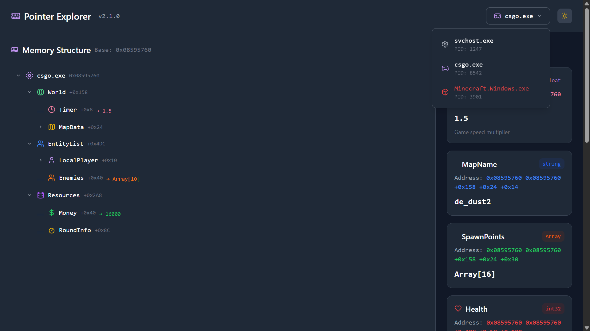
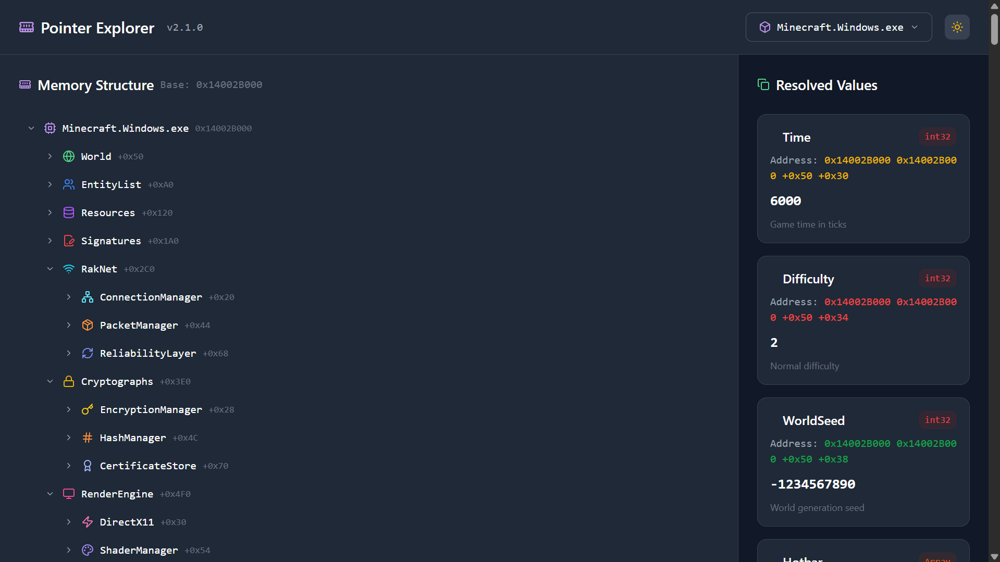
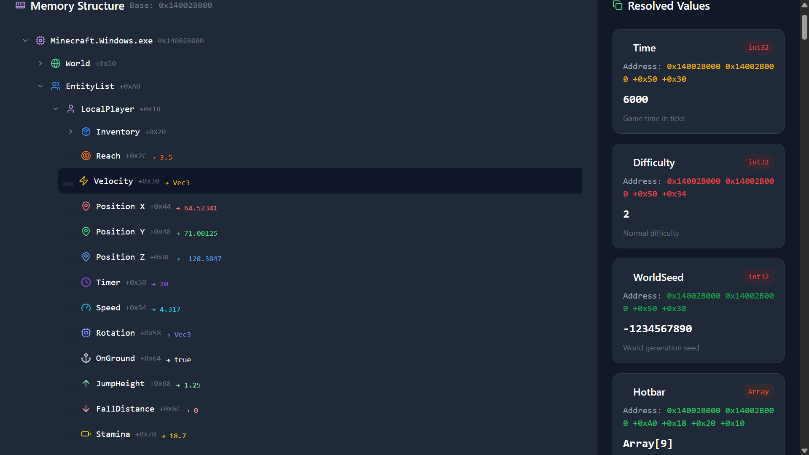
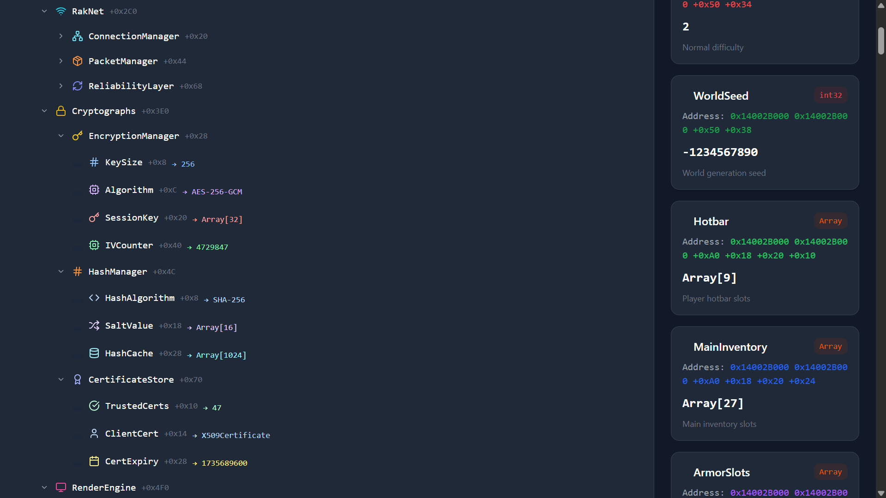

# 🧠 Pointer Chain Visualizer

A project that explains how pointers work using tree structures — visualize how a CPU follows pointer chains through memory to retrieve values.

## 🌳 About

This tool simulates how a CPU navigates pointer chains through memory to find the final value. It uses a tree-based layout to show each step (or offset) in the chain clearly, perfect for reverse engineering, game hacking, or learning about memory access.

## 🧪 Examples

Visual breakdowns of pointer chains in action:

| Example 1 | Example 2 |
|----------|-----------|
|  |  |

| Example 3 | Example 4 |
|----------|-----------|
|  |  |

These illustrate how the CPU walks through memory layers, resolving each offset until it reaches the value node.

## 🔧 Installation

Set up and run the project:

```bash
npm install       # Install dependencies
npm run build     # Build the project
npm start         # Start the app
